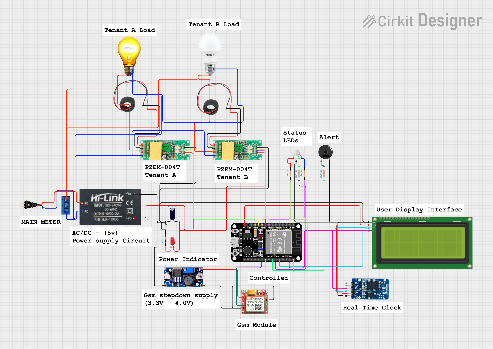
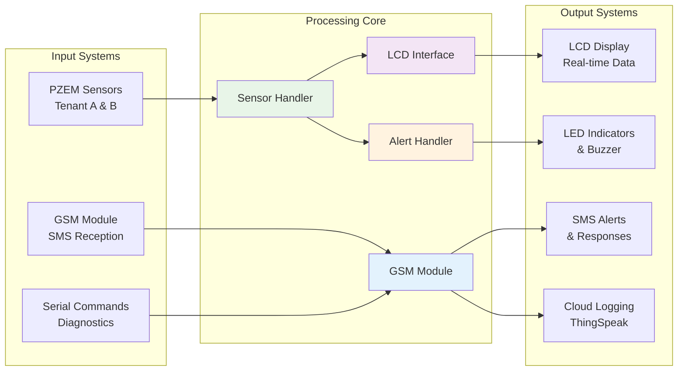
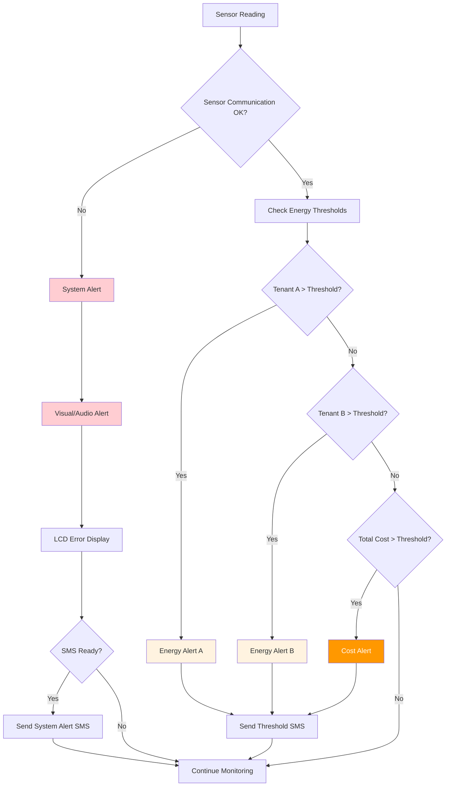
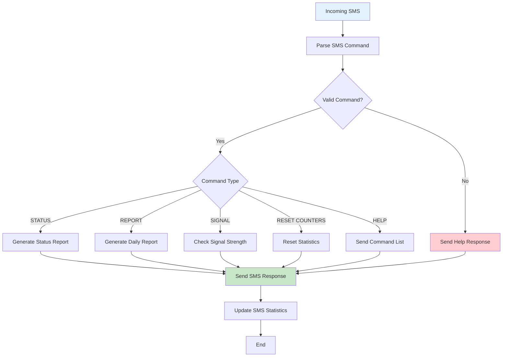
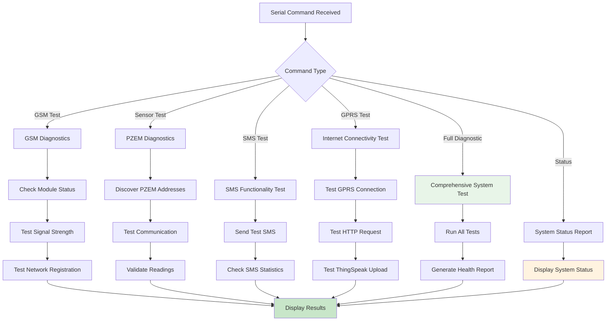

# Dual-Tenant Energy Monitoring System

[](LICENSE)


## 📌 Overview

The **Duo Energy Monitoring System** is an **ESP32-based** solution designed to measure, monitor, and analyze the energy consumption of connected electrical devices in **real-time**.  
It integrates **PZEM-004T energy meters**, **alert indicators**, **SMS alerts**, and **cloud connectivity** for intelligent data visualization and notifications.

This project aims to provide a **low-cost, transparent, modular, and IoT-ready solution** for households, laboratories, and small-scale industries to track power usage, optimize consumption, and enhance energy efficiency.

---

## 🎯 Features

- **Real-time Energy Monitoring** via PZEM-004T modules (voltage, current, power, energy)
- **ESP32-DevKit Control** running **C++** firmware
- **LED & Buzzer Alerts** for configurable threshold violations
- **Modular Code Structure** for easy customization
- **Cloud Integration** (Wi-Fi, GSM-ready) for remote monitoring
- **Multi-device Support** via Modbus RTU over RS485
- **Low Power Consumption** design with sleep mode support

---

## 📦 Hardware Components

| Component                   | Description                                       | Qty |
|-----------------------------|---------------------------------------------------|-----|
| **ESP32**                   | Main MCU with Wi-Fi & Bluetooth                  | 1   |
| **PZEM-004T v3.0**          | Energy monitoring sensor                          | 1–2 |
| **TTL ↔ UART Converter**    | Enables multi-drop Modbus RTU                    | 1   |
| **Active Buzzer**           | Audio alert system                                | 1   |
| **LED Indicators**          | Green (Normal), Red (Alert), Blue (Communication)| 3   |
| **LCD Display**             | Local data visualization                          | 1   |
| **Power Supply**            | 5V regulated                                      | 1   |

### Hardware Connections Diagram


*Figure 1: Complete hardware wiring setup for the project*

---

## 🏗️ Software Architecture

### System Architecture & Flow

```mermaid
flowchart TD
    A[System Start] --> B[Initialize Serial Communications]
    B --> C[Initialize LCD Display]
    C --> D[Initialize Sensor Handler]
    D --> E[Initialize Alert Handler]
    E --> F[Initialize GSM Module]

    F --> G{GSM Initialization Success?}
    G -->|Success| H[Display: GSM Ready]
    G -->|Failed| I[Display: GSM Init Failed]
    
    H --> J[Initial Sensor Reading]
    I --> J
    J --> K[Update Display]
    K --> L[Set Alert States]
    L --> M[Print Instructions & Menu]
    M --> N[Main Loop Start]
    
    %% Main Loop
    N --> O[Handle Serial Commands]
    O --> P{Time for Sensor Reading?}
    P -->|Yes| Q[Read PZEM Sensors]
    P -->|No| T
    
    Q --> R[Update LCD Display]
    R --> S{Sensor Errors?}
    S -->|Yes| S1[Trigger System Alert]
    S -->|No| S2[Clear System Alert]
    
    S1 --> S3[Send SMS Alert if Ready]
    S2 --> T
    S3 --> T[Check Energy Thresholds]
    
    T --> U{Daily Reset Time?}
    U -->|Yes| V[Reset Daily Counters]
    U -->|No| W
    V --> W{Time for Data Logging?}
    
    W -->|Yes| X[Log Data to Cloud]
    W -->|No| Y
    X --> Y{Time for SMS Check?}
    
    Y -->|Yes| Z[Check Incoming SMS]
    Y -->|No| AA
    Z --> AA{Time for API Update?}
    
    AA -->|Yes| BB[Update API & Send Buffered Data]
    AA -->|No| CC
    BB --> CC[Update Alert Handler]
    CC --> DD[Check LCD Backlight Mode]
    DD --> EE[Small Delay]
    EE --> N
    
    %% Styling
    style A fill:#e1f5fe
    style N fill:#fff3e0
    style S1 fill:#ffcdd2
    style S2 fill:#c8e6c9
    style X fill:#e8f5e8
    style Z fill:#f3e5f5
    style BB fill:#e3f2fd
```



### System Components Flow



### Alert System Flow



### SMS Command Processing



### Diagnostic System Flow



---

## ✨ Key Features

- **Dual-Tenant Monitoring**: Simultaneous monitoring of two separate energy units
- **Real-time Alerts**: SMS notifications for energy thresholds and system errors
- **Cloud Integration**: Data logging to ThingSpeak platform
- **Two-way Communication**: SMS command processing for remote monitoring
- **Comprehensive Diagnostics**: Built-in testing for all system components
- **Visual Interface**: LCD display with real-time energy data
- **Robust Error Handling**: System alerts and automatic recovery mechanisms

---

## ⏱️ Timing Intervals

| Function | Interval | Purpose |
|----------|----------|---------|
| Sensor Reading | Every 2 seconds | Real-time monitoring |
| Data Logging | Every 15 minutes | Cloud data storage |
| SMS Check | Every 30 seconds | Incoming message processing |
| API Update | Every 5 minutes | System maintenance |
| Daily Reset | Every 24 hours | Counter reset |

---

## 📚 Required Libraries

```ini
bblanchon/ArduinoJson@^7.0.4
mandulaj/PZEM-004T-v30@^1.1.2
marcoschwartz/LiquidCrystal_I2C@^1.1.4
paulstoffregen/Time@^1.6.1
plerup/EspSoftwareSerial@^8.1.0
```

### ThingSpeak API Cloud Integration

The system automatically uploads energy data to ThingSpeak cloud platform for remote monitoring and historical analysis.

---

## 📂 Project Structure

```
Duo-EM-v1.0/
│
├── platformio.ini
│
├── include/
│   └── config.h                 # Global configuration & pin definitions
│
├── lib/
│   ├── GSMModule/
│   │   ├── GSMModule.h           # Class declaration for GSM handling
│   │   └── GSMModule.cpp         # Class implementation
│   │
│   ├── DisplayHandler/
│   │   ├── DisplayHandler.h      # LCD handling declarations
│   │   └── DisplayHandler.cpp    # Implementation
│   │
│   ├── SensorHandler/
│   │   ├── SensorHandler.h       # Sensor reading declarations
│   │   └── SensorHandler.cpp     # Implementation
│   │
│   ├── AlertHandler/
│   │   ├── AlertHandler.h        # LED & buzzer alerts
│   │   └── AlertHandler.cpp
│
├── src/
│   ├── main.cpp                  # Main orchestration code
│
└── test/                         # Test programs
    ├── test_gsm_main.cpp         # GSM module test (virtual UART)
    ├── test_display_main.cpp     # Display module test
    ├── test_alert_main.cpp       # Alert module test
    └── test_sensor_main.cpp      # Sensor reading test
```

---

## ⚙️ Installation & Setup

1. **Clone Repository**

   ```bash
   git clone https://github.com/yourusername/smart-energy-monitor.git
   cd smart-energy-monitor
   ```

2. **Install Libraries**

   - Open PlatformIO Extension in **VSCode**
   - Libraries will auto-install based on `platformio.ini`
   - Or manually install dependencies listed above

3. **Configure Settings**

   - Edit `config.h` to match your hardware pins and preferences
   - Set your ThingSpeak API key and SMS recipient numbers

4. **Upload Firmware**

   - Select ESP32 DevKit board in PlatformIO
   - Build and upload via USB

5. **Connect Hardware**

   - Wire components as per the circuit diagram in `/img/diagram.png`

---

## 🔧 Diagnostic Commands

### GSM DIAGNOSTICS

- `gsm_test` - Full GSM module test
- `gsm_status` - Show detailed GSM status
- `gsm_signal` - Check signal strength
- `gsm_network` - Show network information

### SMS TESTING

- `sms_send <number> <message>` - Send test SMS
- `sms_test_all` - Send test SMS to all recipients
- `sms_simulate <command>` - Simulate user SMS command
- `sms_stats` - Show SMS statistics

### INTERNET TESTING

- `gprs_test` - Test GPRS connection
- `gprs_status` - Show GPRS status
- `cloud_test` - Test cloud data upload
- `http_test <url>` - Test HTTP request
- `thingspeak_test` - Test ThingSpeak upload

### USER SIMULATION

- `user_status` - Send status report to users
- `user_report` - Send daily report to users
- `user_help` - Show SMS commands for users
- `emergency_alert` - Send emergency test alert

### SYSTEM DIAGNOSTICS

- `status` - Complete system status
- `sensor_test` - Test PZEM sensors
- `threshold_test` - Simulate threshold alerts
- `memory_info` - Show memory usage
- `uptime` - Show system uptime
- `full_diag` - Run complete diagnostics
- `reset_counters` - Reset all statistics

### BASIC COMMANDS

- `test/diag` - Basic sensor diagnostics
- `discover` - Discover PZEM addresses
- `help` - Show command menu

**TIP:** All commands are case-insensitive

---

## 📜 License

This project is licensed under the MIT License – see the LICENSE file for details.

## 🤝 Contribution

- We welcome community contributions!
- Report issues via the GitHub Issues tab
- Submit pull requests for bug fixes or feature additions
- Improve documentation for better adoption

---

## 📧 Contact Maintainer

- **Name:** Saviour Dagadu – Embedded Hardware Designer  
- **📍 Location:** Accra, Ghana  
- **✉️ Email:** [senamdagadusaviour@gmail.com](mailto:senamdagadusaviour@gmail.com)  
- **🔗 GitHub:** [SaviourDagadu](https://github.com/SaviourDagadu)
